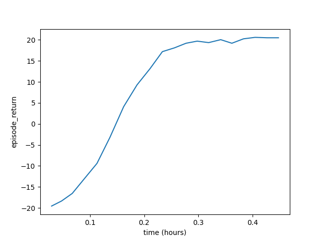

# RLMeta

rlmeta - a flexible lightweight research framework for Distributed 
Reinforcement Learning based on [`PyTorch`](https://pytorch.org/) and 
[`moolib`](https://github.com/facebookresearch/moolib)

## Installation

To build from source, please install [`PyTorch`](https://pytorch.org/) first, 
and then run the commands below.

```
$ git clone https://github.com/facebookresearch/rlmeta
$ cd rlmeta
$ git submodule sync && git submodule update --init --recursive
$ pip install -e .
```

## Run an Example

To run the example for Atari Pong game with PPO algorithm:

```
$ cd examples/atari/ppo
$ python atari_ppo.py env.game="Pong" num_epochs=20
```

We are using [`hydra`](https://hydra.cc/) to define configs for trainining jobs.
The configs are defined in

```
./conf/conf_ppo.yaml
```

The logs and checkpoints will be automatically saved to

```
./outputs/{YYYY-mm-dd}/{HH:MM:SS}/
```

After training, we can draw the training curve by run

```
$ python ../../plot.py --log_file=./outputs/{YYYY-mm-dd}/{HH:MM:SS}/atari_ppo.log --fig_file=./atari_ppo.png --xkey=time
```

One example of the training curve is shown below.




## License
rlmeta is licensed under the MIT License. See [`LICENSE`](LICENSE) for details.
